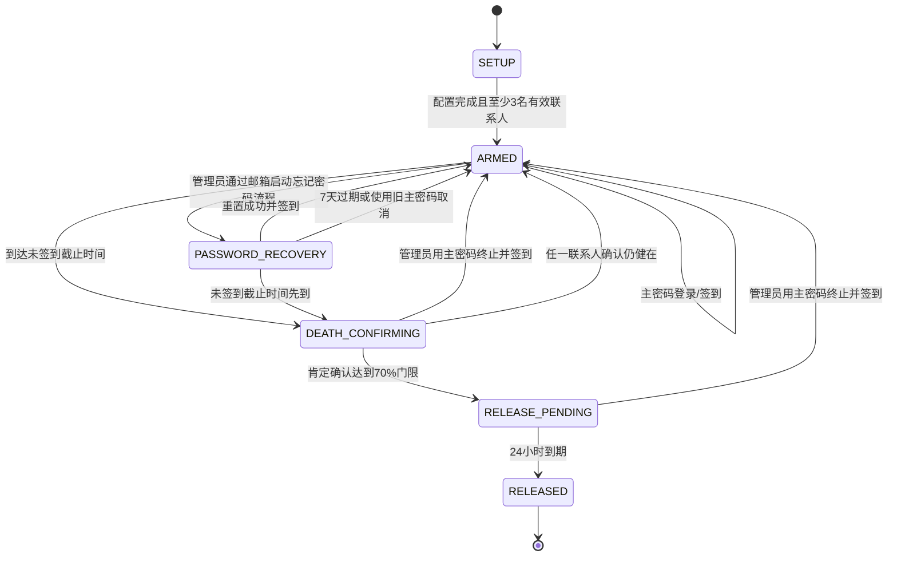

# Digital Legacy System 产品需求文档

> 文档状态：需求已确认  
> 适用版本：V1（一次性完整交付）  
> 默认业务时区：北京时间 `Asia/Shanghai`（UTC+8）  
> 目标读者：项目所有者、开发人员、AI 编码代理  
> 关联文档：[系统架构设计](./02-system-architecture.md) · [数据库设计](./03-database-design.md) · [API 接口设计](./04-api-design.md) · [安全与隐私设计](./05-security-privacy.md)

## 1. 产品定义

Digital Legacy System（数字遗产系统）是一个只服务于单一所有者的数字遗产保管和条件发布系统。所有者通过每日登录并输入主密码完成签到；当连续未签到达到配置阈值后，系统邀请预先登记的紧急联系人参与确认。达到门限后进入 24 小时最终等待阶段，如所有者未使用主密码终止，系统自动公开遗书正文和 ZIP 下载链接，并把链接发送给全部紧急联系人。

本系统只有两个业务角色：

- **管理员（OWNER）**：唯一的系统所有者、遗书作者和日常签到者。
- **紧急联系人（CONTACT）**：由管理员通过邮件邀请，完成注册和强制知情同意后参与确认。

### 1.1 法律定位

系统负责文件的加密保管、条件触发、通知、传递、公开和审计，不负责创设或保证遗嘱的法律效力。管理员必须先按适用法律要求订立遗嘱，再上传其数字副本。

中国《民法典》对自书、代书、打印、录音录像、公证等遗嘱分别规定了形式条件；《电子签名法》第三条把涉及继承等人身关系的文书排除在一般电子签名规则之外。因此，系统生成的确认记录、哈希和审计链只能作为辅助证据，不能替代签名、日期、见证人或公证等法定要件。

参考：

- [《中华人民共和国民法典》继承编相关条文](https://gongbao.court.gov.cn/Details/7f184078694d811fb3314f6af9accf.html)
- [《中华人民共和国电子签名法》第三条](https://www.miit.gov.cn/jgsj/zfs/fl/art/2022/art_e3f623f70c23497e88a941170093446a.html)

## 2. 产品目标与非目标

### 2.1 产品目标

1. 在管理员正常活动时，以低摩擦方式完成每日签到。
2. 在管理员长时间未签到时，通过多个彼此隔离的紧急联系人降低误判风险。
3. 在达到 70% 联系人确认后，给予管理员完整的 24 小时最终撤销窗口。
4. 在发布前，使仅取得数据库或对象存储的攻击者无法解密 ZIP。
5. 在发布后，提供不可撤回的公开遗书正文、ZIP 下载链接和脱敏审计时间线。
6. 提供完整测试模式，使全部流程能够演练而不触碰正式数据和正式公开地址。

### 2.2 非目标

- 不支持多管理员、多租户、组织或家庭账号。
- 不提供法律咨询、公证、见证人服务或遗嘱法律效力认证。
- 不通过第三方死亡数据库、医院、公安或政府接口判断死亡。
- 不提供短信、电话、即时通信软件通知。
- 不提供紧急联系人之间的站内通信或联系人名册查询。
- 不提供联系人自助找回密码或管理员双因素认证。
- 不提供发布后的撤回、删除、隐藏或修改。
- 不提供自动备份、灾难恢复承诺或永久可用性保证。
- 不直接在邮件中发送 ZIP 附件，只发送下载链接。
- 不在公开页面播放 ZIP 内视频；视频仅作为 ZIP 内容下载。

## 3. 核心配置

| 配置项 | 默认值/规则 | 是否可修改 |
|---|---|---|
| 业务时区 | `Asia/Shanghai` | 否 |
| 未签到阈值 | 3 个北京时间自然日 | 是，正整数 |
| 截止前提醒 | 24 小时、12 小时、5 小时、1 小时 | 否 |
| 首次确认门限 | `ceil(有效联系人数 × 70%)` | 否 |
| 主密码重置门限 | `floor(有效联系人数 ÷ 2) + 1` | 否 |
| 最少有效联系人 | 3 人 | 否 |
| 首次确认有效期 | 永久等待 | 否 |
| 主密码重置有效期 | 7 × 24 小时 | 否 |
| 第二阶段时长 | 24 小时 | 否 |
| 第二阶段提醒 | 立即、5 分、15 分、30 分、1/2/4/8/12/18/23 小时、23 小时 50 分 | 否 |
| 邮件失败重试 | 5、10、30、60、1440、4320、43200 分钟 | 否 |
| 发布保留 | 不主动删除；不承诺灾难恢复 | 否 |
| 历史 ZIP | 仅保留当前有效版本，旧密文删除，摘要和审计保留 | 否 |

“有效联系人”是指状态为 `ACTIVE`、已完成邀请注册、已同意当前版本知情书、已纳入当前分片代次且未被删除的联系人。`INVITED`、`PENDING_KEYING` 和已删除联系人不计入分母。

### 3.1 自然日计算示例

最后一次签到发生在 2026 年 8 月 1 日任意时刻，阈值为 3 天：8 月 2、3、4 日均未签到，触发时间为 8 月 5 日 00:00。四次预警时间依次为 8 月 4 日 00:00、12:00、19:00、23:00。

系统内部统一以 UTC 存储时间，但所有业务截止时间、页面和邮件均按北京时间显示。

## 4. 状态模型

`RELEASED` 是不可逆终态。管理员和紧急联系人均不能通过系统撤回、删除、替换或隐藏已发布内容。

测试模式使用独立测试流程实例，不修改上述正式状态机。

## 5. 功能需求

### 5.1 初始化与管理员资料

- **PRD-SETUP-001**：系统只允许创建一个管理员记录。
- **PRD-SETUP-002**：管理员资料至少包括显示姓名、主邮箱、备用邮箱和主密码。
- **PRD-SETUP-003**：主邮箱与备用邮箱不得相同。
- **PRD-SETUP-004**：管理员显示姓名用于确认文字、页面提示和邮件模板中的 `{owner_name}`。
- **PRD-SETUP-005**：满足以下条件前不得进入 `ARMED`：管理员资料完整、至少 3 名有效联系人、当前 ZIP 已上传并激活、ZIP 根目录存在 `will.md`、密钥分片已生成、SMTP 测试成功、管理员确认不可撤回风险。

### 5.2 管理员登录、签到和主密码

- **PRD-AUTH-001**：管理员登录页仅要求输入主密码；系统为单管理员，不要求用户名。
- **PRD-AUTH-002**：每次成功输入主密码登录，都必须在同一数据库事务内记录一次签到。
- **PRD-AUTH-003**：同一北京时间自然日多次成功登录只形成一条有效签到，可在审计中记录多次认证事件。
- **PRD-AUTH-004**：签到成功后重新计算下一截止时间及四次提醒时间。
- **PRD-AUTH-005**：管理员可通过输入旧主密码设置新主密码；修改成功同时算作签到。
- **PRD-AUTH-006**：主密码不得通过普通邮件直接重置，必须执行第 5.8 节的门限恢复流程。
- **PRD-AUTH-007**：管理员在 `DEATH_CONFIRMING` 或 `RELEASE_PENDING` 输入正确主密码时，立即取消当前流程、销毁已提交分片和临时发布密钥、记录当天签到并通知全部联系人。

### 5.3 签到提醒

- **PRD-CHECKIN-001**：系统在截止前 24 小时、12 小时、5 小时和 1 小时向主邮箱发送提醒。
- **PRD-CHECKIN-002**：主邮箱发生 SMTP 明确失败时，立即尝试备用邮箱。
- **PRD-CHECKIN-003**：SMTP 返回接收成功即视为发送成功；系统不判断垃圾邮件、用户阅读状态或后续退信之外的实际送达情况。
- **PRD-CHECKIN-004**：提醒链接只能打开登录页面，不能直接签到或改变流程。
- **PRD-CHECKIN-005**：每个提醒任务必须幂等，调度器重启不得造成重复邮件。

### 5.4 紧急联系人管理

- **PRD-CONTACT-001**：管理员可在正常状态邀请、查看、删除紧急联系人，也可向某位联系人发送“使用旧密码修改密码”的邮件。
- **PRD-CONTACT-002**：联系人资料为唯一显示姓名、唯一邮箱、密码、状态和知情书版本。
- **PRD-CONTACT-003**：联系人通过一次性邀请链接注册；链接默认 72 小时有效，过期后管理员可以重发。
- **PRD-CONTACT-004**：联系人注册时必须完整展示知情书，滚动至底部后主动勾选并确认（至少阅读30秒）；拒绝则不能注册。
- **PRD-CONTACT-004A**：联系人完成注册后先进入 `PENDING_KEYING`；管理员输入主密码生成包含该联系人的新门限分片代次后，联系人才能转为 `ACTIVE` 并计入门限。
- **PRD-CONTACT-005**：联系人以姓名和密码登录；邮箱仅用于邀请和通知，不作为登录名。
- **PRD-CONTACT-006**：联系人只能使用旧密码修改密码，不能通过邮箱或其他联系人找回。
- **PRD-CONTACT-007**：联系人忘记密码时，管理员只能删除后重新邀请；重新邀请视为新联系人。
- **PRD-CONTACT-008**：任何死亡确认或主密码恢复流程活动期间，联系人名单及门限快照锁定，不允许增删或重新分片。
- **PRD-CONTACT-009**：联系人彼此不可见，不能查看其他联系人的姓名、邮箱、确认进度明细或通过系统联系对方。
- **PRD-CONTACT-010**：唯一例外是联系人选择“仍然健在”并终止流程时，系统按知情书约定把该联系人的姓名和邮箱发给其他联系人。

### 5.5 第一次死亡确认

- **PRD-DEATH1-001**：达到未签到截止时间时，系统对有效联系人列表、总人数和门限人数建立不可变快照并进入 `DEATH_CONFIRMING`。
- **PRD-DEATH1-002**：系统一次性向快照中的全部联系人发送确认邮件；不因某人已确认而向其他联系人发送进度邮件。
- **PRD-DEATH1-003**：邮件链接只是入口；联系人必须输入自己的姓名和密码。联系人也可以从网站联系人登录入口进入同一页面。
- **PRD-DEATH1-004**：联系人必须明确选择“可能或确认已经离世”或“仍然健在”。
- **PRD-DEATH1-005**：肯定确认必须手动输入且完全匹配：`我确认{管理员姓名}已经无法联络，且有很大可能已经离世或已确认离世`。
- **PRD-DEATH1-006**：否定确认必须手动输入且完全匹配：`我确认{管理员姓名}仍然健在，并终止本次确认流程`。
- **PRD-DEATH1-007**：页面拦截复制、粘贴、拖放和自动填充。
- **PRD-DEATH1-008**：每位联系人对同一流程只能作出一次最终决定。
- **PRD-DEATH1-009**：任一联系人否定确认后立即终止流程，清空其他已提交分片，将否定时间记为代理存活证明和新的签到计时起点，并通知全部联系人。
- **PRD-DEATH1-010**：肯定确认人数达到 `ceil(N × 70%)` 时立即进入 `RELEASE_PENDING`；这里的“最后一位”是达到门限的那位联系人，不要求所有联系人确认。
- **PRD-DEATH1-011**：首次确认不设置超时，未达到门限且无人否定时永久等待。

### 5.6 第二次确认与 24 小时等待

- **PRD-DEATH2-001**：达到首次确认门限的准确时间即为第二阶段开始时间和 24 小时倒计时起点。
- **PRD-DEATH2-002**：系统在开始后以下偏移量向主邮箱提醒：`0m, 5m, 15m, 30m, 1h, 2h, 4h, 8h, 12h, 18h, 23h, 23h50m`。
- **PRD-DEATH2-003**：主邮箱发生 SMTP 明确失败时立即尝试备用邮箱。
- **PRD-DEATH2-004**：每封邮件只提供入口；管理员必须在网站输入主密码才能终止。
- **PRD-DEATH2-005**：第二阶段不允许联系人暂停、否定或终止；所有第一次确认链接均失效。
- **PRD-DEATH2-006**：管理员成功终止后，系统通知全部联系人、销毁临时发布密钥、记录签到并返回 `ARMED`。
- **PRD-DEATH2-007**：24 小时到期后，以数据库时间和原子状态更新为准进入发布；迟到的终止请求返回“已发布且不可撤回”。

### 5.7 文件上传、激活和发布

- **PRD-FILE-001**：管理员直接上传 ZIP；根目录必须存在唯一的 `will.md`，文件名大小写敏感。
- **PRD-FILE-002**：ZIP 可包含视频和其他任意管理员自有文件，但网站仅渲染 `will.md`，其余内容只通过 ZIP 下载。
- **PRD-FILE-003**：上传内容在浏览器端分块加密后进入对象存储；对象存储只保存密文。
- **PRD-FILE-004**：新版本完成上传、完整性验证、密钥包装和联系人分片后才能原子激活。
- **PRD-FILE-005**：激活新版本后删除旧版本密文；永久保留旧版本的版本号、密文摘要、时间和审计事件，不保留旧文件。
- **PRD-FILE-006**：发布时解密当前 ZIP，验证完整性，安全读取根目录 `will.md`，禁用 Markdown 原始 HTML并进行 HTML 清洗。
- **PRD-FILE-007**：发布结果包括公开遗书页面、无需密码的明文 ZIP 下载地址和脱敏审计时间线。
- **PRD-FILE-008**：发布是不可逆操作；任何角色均无删除、撤回、替换或重新加密入口。
- **PRD-FILE-009**：公开响应设置 `X-Robots-Tag: noindex, nofollow, noarchive`，页面设置同等 robots 元数据。

### 5.8 主密码门限恢复

- **PRD-RECOVERY-001**：登录页点击忘记主密码后，系统只向已配置的主邮箱和备用邮箱发送一次性启动链接，不立即公开状态或通知联系人。
- **PRD-RECOVERY-002**：任一有效启动链接被点击后，创建 7 天有效的恢复流程，向所有有效联系人发送邮件，并在首页显示“主密码重置中”和剩余所需人数。
- **PRD-RECOVERY-003**：联系人必须输入姓名和密码，解开自己的恢复分片并确认协助重置。
- **PRD-RECOVERY-004**：恢复门限为 `floor(N ÷ 2) + 1`，N 在流程开始时快照并锁定。
- **PRD-RECOVERY-005**：达到门限后，系统向主邮箱和备用邮箱发送设置新主密码的单次链接；联系人不能设置或获知新主密码。
- **PRD-RECOVERY-006**：设置新主密码后重新包装管理员密钥，销毁恢复过程中的临时密钥，记录当天签到并返回 `ARMED`。
- **PRD-RECOVERY-007**：管理员输入仍然有效的旧主密码可以随时取消恢复并签到。
- **PRD-RECOVERY-008**：恢复流程 7 天过期后清除分片和令牌，返回 `ARMED`，且过期本身不算签到。
- **PRD-RECOVERY-009**：恢复流程不暂停未签到计时；若死亡确认截止时间先到，恢复流程立即取消并进入 `DEATH_CONFIRMING`。

### 5.9 首页和公开页面

| 正式状态 | 未认证访问者看到的内容 |
|---|---|
| `SETUP` / `ARMED` | 普通首页，不显示最后签到时间、联系人数量或内部配置 |
| `PASSWORD_RECOVERY` | 主密码重置中、所需人数、已确认人数、剩余人数、到期时间 |
| `DEATH_CONFIRMING` | 生存状态确认中、所需人数、已肯定确认人数；不显示联系人身份 |
| `RELEASE_PENDING` | 发布等待中、精确到秒的 24 小时倒计时 |
| `RELEASED` | 遗书正文、ZIP 下载链接、文件摘要、脱敏审计时间线 |

页面必须适配手机和桌面浏览器，只提供中文界面。

### 5.10 邮件投递

- **PRD-MAIL-001**：邮件通过管理员配置的 SMTP 服务发送。
- **PRD-MAIL-002**：除最终发布邮件外，邮件内链接不能直接改变状态，必须回到网站输入对应密码。
- **PRD-MAIL-003**：最终发布邮件只包含公开下载链接和摘要，不附带 ZIP。
- **PRD-MAIL-004**：一次逻辑投递首次立即发送，失败后相对上一次失败依次等待 5、10、30、60、1440、4320、43200 分钟，共重试 7 次。
- **PRD-MAIL-005**：网站发布与邮件投递解耦；最终邮件失败不得推迟或回滚公开发布。
- **PRD-MAIL-006**：每封业务邮件拥有唯一幂等键，避免任务重复执行造成重复发送。
- **PRD-MAIL-007**：不在邮件正文中包含密码、密钥分片、遗书正文、ZIP 或私人审计信息。

### 5.11 审计

- **PRD-AUDIT-001**：记录登录、签到、密码修改、联系人邀请/注册/删除、同意书版本、文件上传/激活、流程迁移、联系人决定、密钥重建/销毁、邮件任务和发布事件。
- **PRD-AUDIT-002**：记录时间、主体、结果、IP、User-Agent、请求关联 ID 和必要元数据，但绝不记录密码、会话令牌、明文密钥、密钥分片、SMTP 凭据或遗书正文。
- **PRD-AUDIT-003**：私有审计日志无限期保留，并通过链式摘要提供篡改可发现性。
- **PRD-AUDIT-004**：发布时只公开脱敏事件时间线；联系人姓名、邮箱、IP、User-Agent 和内部错误不得公开。
- **PRD-AUDIT-005**：发布页面公开当前 ZIP 的 SHA-256 摘要和公开审计链最终摘要。

### 5.12 测试模式

- **PRD-TEST-001**：测试流程使用独立命名空间、独立记录和独立对象前缀，不改变正式签到、联系人确认或状态。
- **PRD-TEST-002**：测试邮件主题必须以 `【测试】` 开头，并且只允许发送到管理员配置的测试收件人白名单。
- **PRD-TEST-003**：测试发布只能进入带有不可猜测标识的测试预览地址，禁止写入正式公开地址。
- **PRD-TEST-004**：测试模式支持完整模拟邀请、确认、否定、密码恢复、加速的 24 小时倒计时、邮件失败重试和发布。
- **PRD-TEST-005**：测试数据允许管理员清理；清理操作不得影响正式数据。

## 6. 紧急联系人强制知情书

注册页面必须完整展示以下文本。`{owner_name}`、处理者联系方式、隐私政策地址和版本日期由系统填充。

### 数字遗产紧急联系人知情与同意书

你受 `{owner_name}` 邀请，成为其 Digital Legacy System 的紧急联系人。注册前请完整阅读并确认：

1. 本系统会在 `{owner_name}` 连续未签到达到预设期限后，通过邮件通知你参与生存状态确认。系统未接入政府、医院或其他权威死亡登记，仅依据签到和联系人决定执行自动流程。
2. 你需要妥善保存自己设置的密码。密码无法通过邮件或其他联系人找回；忘记后只能由管理员删除账号并重新邀请。
3. 你与其他紧急联系人相互不可见，也无法通过系统联系对方。系统不会向你披露其他联系人的确认明细。
4. 选择“可能或确认已经离世”时，你必须手动输入：`我确认{owner_name}已经无法联络，且有很大可能已经离世或已确认离世`。达到当时有效联系人总数 70% 向上取整的门限后，系统将进入 24 小时最终等待阶段。
5. 选择“仍然健在”时，你必须手动输入：`我确认{owner_name}仍然健在，并终止本次确认流程`。该选择会立即终止当次流程，并作为新的存活计时起点。
6. 如果你选择“仍然健在”，系统会把你的姓名和邮箱地址发送给其他紧急联系人，用于说明是谁作出了终止决定。你对此项个人信息提供和披露作出明确、单独同意。
7. 进入 24 小时最终等待阶段后，你的确认入口将失效。此阶段只有 `{owner_name}` 输入主密码才能终止；紧急联系人不能暂停、否定或撤回流程。
8. 24 小时内未被终止时，系统将公开遗书正文、ZIP 下载链接和脱敏审计时间线，并把公开链接发送给所有紧急联系人。发布后管理员和任何紧急联系人都不能通过系统撤回或删除，公开内容也可能被第三方复制、转载或镜像。
9. 在 `{owner_name}` 忘记主密码时，你可能收到密码恢复协助请求。超过半数有效联系人确认后，系统只允许管理员通过其邮箱设置新密码；你不会获得管理员的新密码。
10. 系统将处理你的姓名、邮箱、密码哈希、登录和确认时间、IP、设备信息及审计记录，用于身份认证、流程执行、安全防护和争议追溯。密码、密钥和密钥分片不会写入日志。私有审计记录按系统设定长期保存。
11. 本系统不能保证上传文件本身具有法律效力，也不能绝对保证邮件送达、服务器永久可用、公开内容不被传播或浏览器禁止粘贴功能不可绕过。
12. 你应仅在基于真实情况、经过慎重判断后作出确认，不得共享密码或代替他人操作。

注册必须设置以下独立勾选项，默认均不勾选：

- `[ ]` 我已完整阅读并理解上述流程和不可撤回后果。
- `[ ]` 我同意系统按上述目的处理我的个人信息。
- `[ ]` 我单独同意在我选择“仍然健在”时，将我的姓名和邮箱提供给其他紧急联系人。
- `[ ]` 我理解进入第二阶段后紧急联系人不能再终止流程。

只有全部勾选并点击“同意并注册”才能继续。系统记录知情书版本、文本 SHA-256、同意时间、IP 和 User-Agent。

## 7. 邮件模板

所有时间均使用 `YYYY-MM-DD HH:mm:ss（北京时间）`。所有按钮均应同时提供纯文本 URL。

### 7.1 联系人邀请

**主题：** `【Digital Legacy System】{owner_name} 邀请你成为紧急联系人`

**正文：**

> 你好，{contact_name}：  
> {owner_name} 邀请你成为其数字遗产系统的紧急联系人。你需要先阅读并同意完整知情书，然后设置个人密码。  
> 邀请有效期至：{expires_at}。  
> 注册入口：{action_url}  
> 本链接仅用于进入注册页面，不能代替密码或确认操作。若你不认识邀请人，请忽略本邮件。

### 7.2 签到截止前提醒

**主题：** `【Digital Legacy System】距离签到截止还有 {remaining}`

**正文：**

> 你的下一次签到截止时间为 {deadline_at}，当前剩余 {remaining}。  
> 请登录网站并输入主密码完成签到：{action_url}  
> 打开链接不会自动签到，只有正确输入主密码才会改变状态。

### 7.3 首次死亡确认请求

**主题：** `【重要】请确认 {owner_name} 的联络状态`

**正文：**

> {owner_name} 已超过预设期限未完成签到，系统现已进入第一次确认流程。  
> 请根据你实际掌握的情况，在网站中选择“可能或确认已经离世”或“仍然健在”，并输入你的姓名、密码及指定确认文字。  
> 确认入口：{action_url}  
> 本流程没有自动到期时间。邮件链接本身不会作出确认。

### 7.4 联系人否定后终止

**主题：** `【Digital Legacy System】本次确认流程已终止`

**正文：**

> {owner_name} 的紧急联系人 {denier_name} 已确认 {owner_name} 仍然健在，本次流程已立即终止。  
> 作出终止决定的联系人邮箱：{denier_email}  
> 该决定时间已作为新的存活计时起点：{cancelled_at}。

### 7.5 管理员主动终止

**主题：** `【Digital Legacy System】{owner_name} 已主动终止确认流程`

**正文：**

> {owner_name} 已于 {cancelled_at} 使用主密码完成验证并终止本次流程。系统已清除本次确认数据并重新开始签到计时，无需你继续操作。

### 7.6 第二阶段管理员提醒

**主题：** `【紧急】数字遗产将在 {remaining} 后公开`

**正文：**

> 紧急联系人确认已达到门限，系统将在 {release_at} 自动公开当前数字遗产。  
> 当前剩余：{remaining}。  
> 如需终止，请进入 {action_url} 并输入主密码。打开邮件或链接本身不会终止流程。

### 7.7 最终发布与联系人交付

**主题：** `【Digital Legacy System】{owner_name} 的数字遗产已发布`

**正文：**

> 系统已于 {published_at} 按预设流程公开 {owner_name} 的数字遗产。  
> 遗书页面：{legacy_url}  
> ZIP 下载：{download_url}  
> ZIP SHA-256：{sha256}  
> 链接无需密码，可能被复制或转载。系统不会在邮件中附加 ZIP 文件。

### 7.8 联系人旧密码修改

**主题：** `【Digital Legacy System】请修改你的紧急联系人密码`

**正文：**

> {owner_name} 已向你发起密码修改请求。请在 {expires_at} 前打开 {action_url}，输入旧密码后设置新密码。  
> 如果你已经忘记旧密码，此链接无法恢复账号，请联系 {owner_name} 删除并重新邀请。

### 7.9 主密码恢复启动

**主题：** `【Digital Legacy System】确认启动主密码恢复`

**正文：**

> 有人请求启动主密码恢复。只有打开本一次性链接后，系统才会通知紧急联系人并公开显示恢复状态：{action_url}  
> 链接有效期至 {expires_at}。如果并非你本人操作，请不要点击。

### 7.10 主密码恢复联系人请求

**主题：** `【Digital Legacy System】请协助 {owner_name} 恢复主密码`

**正文：**

> {owner_name} 已通过其邮箱启动主密码恢复流程。请在 {expires_at} 前进入 {action_url}，输入你的姓名和密码并确认是否协助。  
> 超过半数有效联系人确认后，只有 {owner_name} 的主邮箱或备用邮箱能够设置新密码。

### 7.11 设置新主密码

**主题：** `【Digital Legacy System】联系人门限已达到，请设置新主密码`

**正文：**

> 紧急联系人确认已达到恢复门限。请在 {expires_at} 前通过一次性链接设置新主密码：{action_url}  
> 设置成功将同时完成当天签到。不要向任何人转发此链接。

## 8. 非功能需求

- **PRD-NFR-001 可用性**：核心状态迁移、签到、确认和发布操作必须使用数据库事务及幂等键；服务重启后可继续未完成任务。
- **PRD-NFR-002 一致性**：任何时刻最多存在一个正式活动流程；发布与取消必须通过条件更新竞争，只有一个结果成功。
- **PRD-NFR-003 性能**：除文件上传下载外，正常 API 的服务端 P95 响应目标小于 500ms；密码 KDF 操作除外。
- **PRD-NFR-004 移动端**：支持当前维护版本的主流移动和桌面浏览器，确认文字输入在中文输入法下可用。
- **PRD-NFR-005 无障碍**：关键表单具备标签、键盘操作、明确错误文本和倒计时的屏幕阅读器公告降频机制。
- **PRD-NFR-006 安全**：必须满足 [安全与隐私设计](./05-security-privacy.md) 中标记为“必须”的控制。
- **PRD-NFR-007 无备份风险**：系统不执行自动备份；“永久保留”仅指不主动删除且服务和存储仍可用期间保留。
- **PRD-NFR-008 可维护性**：前后端、工作进程、数据库迁移和基础设施配置均纳入同一代码仓库并支持容器化部署。
- **PRD-NFR-009 可测试性**：状态机、时间计算、门限取整、并发发布/取消、密钥重建和邮件重试必须具备自动化测试。

## 9. 关键验收场景

1. **自然日边界**：8 月 1 日签到、阈值 3 天时，系统准确生成 8 月 5 日 00:00 截止和四个提醒任务。
2. **门限取整**：3/4/5/10 名联系人时，死亡确认门限分别为 3/3/4/7；恢复门限分别为 2/3/3/6。
3. **否定优先**：首次确认已有若干肯定票时，任一有效否定必须原子终止并清除分片。
4. **并发门限**：达到门限的两个并发请求只允许一次状态迁移和一次第二阶段任务编排。
5. **最终竞争**：24 小时到期发布与管理员终止并发时，数据库只产生一个终态；先完成条件更新者生效。
6. **阶段权限**：进入第二阶段后，所有联系人确认接口返回流程阶段错误，联系人无法终止。
7. **密码恢复优先级**：恢复期间到达未签到截止，恢复立即取消并启动死亡确认。
8. **文件保密**：未达到任何门限时，仅取得数据库、对象存储和应用配置但没有任何用户密码，不得解密 ZIP。
9. **发布完整性**：发布前验证密文认证标签，发布后 ZIP SHA-256 与公开摘要一致，`will.md` 不执行脚本或原始 HTML。
10. **不可撤回**：进入 `RELEASED` 后所有删除、替换、取消接口均不存在或永久返回不可变状态错误。
11. **邮件解耦**：最终邮件全部失败时，公开页面和下载仍按 24 小时截止时间出现。
12. **测试隔离**：测试流程产生的邮件、对象、审计和状态均不能出现在正式公开页面或改变正式截止时间。

## 10. 已接受的固有风险

管理员已明确接受以下风险，产品不得通过文案掩盖：

- 紧急联系人可能误判、合谋、泄露密码或遭账号攻击。
- 达到门限后，服务器在第二阶段必须临时具备解密能力，不能再称为严格零知识。
- 主密码同时承担登录、签到、终止和管理员密钥保护职责，泄露影响重大。
- 不启用双因素认证会降低账号保护能力。
- SMTP 接收成功不等于邮件必然被阅读。
- 公开内容无法真正永久控制、撤回或阻止第三方传播。
- 不做备份意味着服务器、数据库或对象存储损坏后可能永久丢失。
- 系统不能保证遗嘱文件符合法定形式或最终被法院采纳。
