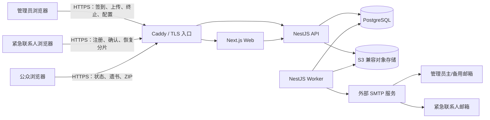
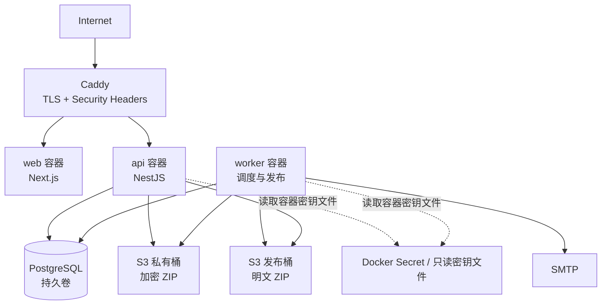
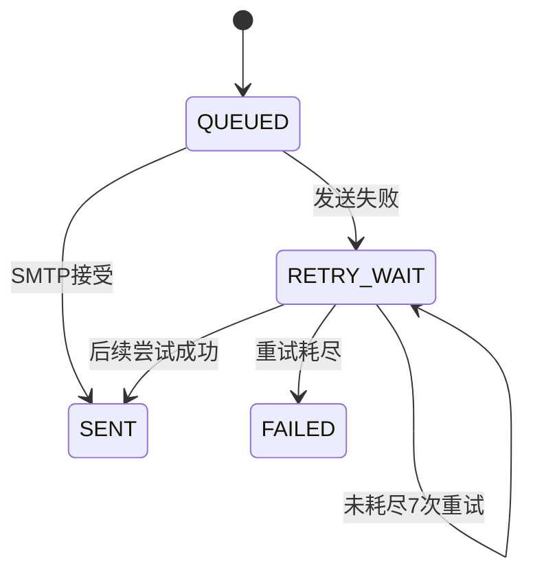

# Digital Legacy System 系统架构设计

> 文档状态：设计基线  
> 业务时区：`Asia/Shanghai`  
> 关联需求：[产品需求文档](./01-product-requirements.md)  
> 数据与接口：[数据库设计](./03-database-design.md) · [API 接口设计](./04-api-design.md) · [安全与隐私设计](./05-security-privacy.md) · [页面设计与交互规格](./06-page-specifications.md)

## 1. 架构结论

系统采用 TypeScript 单仓库、前后端分离、数据库持久化任务的模块化单体架构：

- Web：Next.js，负责中文响应式页面、客户端文件加密和联系人密钥操作。
- API：NestJS，负责身份认证、业务状态机、权限、事务和审计。
- Worker：复用 NestJS 领域代码，负责签到截止扫描、邮件、第二阶段提醒和最终发布。
- 数据库：PostgreSQL，保存业务数据、状态、审计及 `pg-boss` 持久化任务。
- 对象存储：S3 兼容存储，私有桶保存加密 ZIP，公开桶保存最终明文 ZIP。
- 密码与密钥：Argon2id、XChaCha20-Poly1305 secretstream、X25519 sealed box、Shamir 门限秘密共享。
- 入口：Caddy 或同等反向代理，负责 TLS、HSTS、请求体上限和安全响应头。
- 部署：境外 Linux 云服务器上的 Docker Compose；不绑定特定云厂商。

选择模块化单体而不是微服务，是因为系统只有一个管理员且请求量极低，关键难点是状态一致性和密钥安全，不是水平扩展。API 与 Worker 分进程部署，但共享领域模型和 PostgreSQL 事务边界。

## 2. 系统上下文



## 3. 部署拓扑



### 3.1 网络边界

- 仅 Caddy 的 80/443 端口对公网开放；80 永久重定向到 443。
- PostgreSQL、API 内部端口和 Worker 不映射到公网。
- 对象存储私有桶永不公开；发布桶可以通过应用下载处理器或独立只读域名访问。
- SMTP 凭据和阶段密钥通过只读 secret 文件注入，不写入镜像、仓库或数据库。
- 主机使用 NTP 同步；业务截止判断以 PostgreSQL `clock_timestamp()` 为最终时间源。

### 3.2 无备份约束

按已确认需求，系统不执行数据库或对象存储备份。持久卷损坏、云账号丢失、误操作或对象存储故障可能造成不可恢复的数据丢失。“永久保留”只表示应用没有自动删除规则，并不构成可用性或灾难恢复保证。

## 4. 代码组织

建议仓库结构：

```text
Digital-Legacy-System/
├─ apps/
│  ├─ web/                 # Next.js 页面与浏览器加密
│  ├─ api/                 # NestJS HTTP API
│  └─ worker/              # pg-boss 消费者、调度、发布
├─ packages/
│  ├─ domain/              # 状态机、门限和时间规则
│  ├─ crypto/              # 浏览器/服务端兼容密码协议
│  ├─ contracts/           # OpenAPI DTO、错误码、事件类型
│  ├─ email-templates/     # 中文邮件模板
│  └─ test-fixtures/       # 固定测试向量
├─ migrations/             # PostgreSQL 迁移
├─ infra/                  # Docker Compose、Caddy、部署示例
├─ docs/                   # 本设计文档
└─ tests/
   ├─ integration/
   ├─ e2e/
   └─ crypto-vectors/
```

所有依赖使用锁文件固定版本；上线前选择当时仍处于安全维护期的 Node.js LTS 和框架稳定版，不在架构文档中硬编码未来会过时的补丁版本。

## 5. 领域模块

| 模块 | 职责 | 禁止承担的职责 |
|---|---|---|
| Identity | 管理员/联系人认证、会话、密码变更 | 不解密遗书正文 |
| Check-in | 自然日签到、截止和预警计算 | 不直接发邮件 |
| Contacts | 邀请、注册、同意书、删除、密钥公钥 | 不披露联系人名册 |
| Vault | 文件加密元数据、密钥包装、分片代次 | 不决定流程状态 |
| Workflow | 死亡确认、恢复流程、状态迁移和门限 | 不直接操作 SMTP |
| Notification | 邮件渲染、投递、回退、重试 | 不改变业务状态 |
| Publication | 最终解密、完整性检查、Markdown 提取和发布 | 不允许发布后修改 |
| Audit | 私有事件链和公开脱敏投影 | 不记录密码或明文密钥 |
| Simulation | 测试命名空间和加速时钟 | 不写正式表或正式对象前缀 |

模块间通过领域服务和数据库事务协作，不通过进程内事件假设“最终一定执行”；所有异步副作用必须先写 Outbox 或持久化任务。

## 6. 密码与密钥架构

### 6.1 密钥命名

| 名称 | 生成位置 | 用途 | 持久化形式 |
|---|---|---|---|
| `MP` | 管理员输入 | 登录、签到、终止、保护管理员密钥包装 | 仅 Argon2id 验证值；不保存明文 |
| `CKP` | 联系人输入 | 联系人登录、保护其私钥 | 仅 Argon2id 验证值；不保存明文 |
| `VK` | 管理员浏览器 CSPRNG | 保险库根密钥，包装每版 ZIP 的 `DEK` | 只保存密文包装或门限分片 |
| `DEK_v` | 管理员浏览器 CSPRNG | 加密第 v 版 ZIP | 由 `VK` 认证加密后保存 |
| `OWNER_KEK` | 浏览器由 `MP` + 独立盐经 Argon2id 派生 | 包装 `VK` | 不持久化 |
| `CONTACT_KEK` | 浏览器由 `CKP` + 独立盐经 Argon2id 派生 | 包装联系人私钥 | 不持久化 |
| `CPK/CSK` | 联系人浏览器 | X25519 公钥/私钥，接收加密分片 | 公钥明文；私钥仅保存密文包装 |
| `STAGE_KEK` | 部署时 CSPRNG | 第二阶段和恢复阶段的崩溃恢复包装 | 只读 secret 文件，不入库 |

身份认证的 Argon2id 哈希和密钥派生使用不同盐、不同用途标签，不能复用输出。密码不使用 SHA-256、AES 或其他可逆方式保存。

### 6.2 保险库创建

1. 管理员浏览器生成随机 256 位 `VK`。
2. 浏览器以主密码和随机盐派生 `OWNER_KEK`。
3. 使用 XChaCha20-Poly1305 将 `VK` 包装为 `owner_vault_envelope`。
4. 服务器保存管理员认证用 Argon2id 哈希、KDF 参数、盐和 `owner_vault_envelope`。
5. 当至少 3 位联系人完成注册后，管理员再次输入主密码，浏览器解开 `VK` 并为联系人生成两套相互独立的 Shamir 分片：
   - 死亡发布分片：门限 `ceil(N × 0.70)`；
   - 主密码恢复分片：门限 `floor(N ÷ 2) + 1`。
6. 每份分片使用对应联系人的 X25519 公钥 sealed-box 加密后上传。数据库只保存加密分片和分片代次。

两套分片必须使用不同随机多项式和用途标签，禁止跨流程混用。

### 6.3 联系人密钥创建

1. 联系人接受邀请并设置 `CKP`。
2. 浏览器生成 X25519 密钥对 `CPK/CSK`。
3. 浏览器由 `CKP` 和随机盐派生 `CONTACT_KEK`，使用 XChaCha20-Poly1305 加密 `CSK`。
4. 服务器保存 `CPK`、加密后的 `CSK`、KDF 参数和认证哈希。
5. 联系人使用旧密码改密时，只重新包装 `CSK` 并更新认证哈希，不需要重建 Shamir 分片。

联系人密码会通过 TLS 发送给认证 API 进行 Argon2id 验证，同时在浏览器内用于解开私钥。后端不得记录请求体或密码。该设计防御数据库/对象存储的离线泄露，但不能防御已经控制线上应用并篡改 JavaScript 或抓取进程内存的攻击者；详细边界见安全文档。

### 6.4 ZIP 上传

1. 浏览器校验文件为 ZIP，并确认根目录存在唯一 `will.md`；这只是用户体验校验，发布时服务端必须再次验证。
2. 浏览器生成随机 `DEK_v`。
3. 使用 libsodium `crypto_secretstream_xchacha20poly1305` 分块加密 ZIP，最后一块使用 `TAG_FINAL`。
4. 使用 `VK` 包装 `DEK_v`，关联数据至少包含 `package_id`、版本号、算法版本和密文摘要。
5. 通过预签名上传或 API 流式上传把密文写入私有桶。
6. 完成接口验证对象大小、密文 SHA-256 和 secretstream 头后，将版本标记为 `READY`。
7. 激活操作在事务中切换当前包，并在事务提交后异步删除旧密文对象。

libsodium 的 secretstream API 为大文件提供分块认证加密、顺序完整性和最终块标记，适合避免把整个视频 ZIP 放入内存。[libsodium secretstream 文档](https://doc.libsodium.org/secret-key_cryptography/secretstream)

### 6.5 死亡确认分片重建

1. 首次流程创建时快照当前联系人和分片代次。
2. 联系人输入密码后，浏览器解开 `CSK`，再解开其死亡发布分片。
3. 浏览器把分片通过 TLS 发送到 API；API 只在联系人确认事务成功后接收并保存该流程的临时分片。
4. 达到门限的事务取得流程行锁，重建 `VK`，通过验证密文检查密钥正确性。
5. API 立即使用 `STAGE_KEK` 包装 `VK`，保存到 `release_secret_sessions`，删除所有明文和临时分片，并进入第二阶段。
6. 第二阶段取消时删除包装后的 `VK`；到期发布时 Worker 才解开。

达到门限后，服务器为了自动发布必须暂时具备解密能力。这是产品已接受的边界：门限前是离线零知识式存储保护，门限后转为受控服务器解密阶段。

### 6.6 主密码恢复

恢复联系人使用与死亡流程相同的客户端私钥解包方式，但提交的是独立恢复分片。达到多数门限后，服务器重建 `VK` 并使用 `STAGE_KEK` 临时包装。只有持有管理员主邮箱或备用邮箱单次令牌的浏览器才能提交新主密码。成功后建立新的 `owner_vault_envelope`、更新认证哈希并销毁临时 `VK`。

联系人只贡献分片，不会看到 `VK` 或新主密码。达到门限的服务器在恢复窗口内具有临时解密能力，安全边界与第二阶段相同。

### 6.7 联系人名单变化

正常状态下增删联系人时：

1. 管理员必须重新输入主密码以解开 `VK`。
2. 以新的有效联系人集合重新生成死亡与恢复两套分片及新代次。
3. 在单一事务中激活新代次并废弃旧代次。
4. 旧加密分片异步删除；审计保留代次摘要，不保存分片内容。

已经被联系人自行解开的旧分片无法从其设备或记忆中“远程撤销”，这是门限密码学的固有限制。系统只在活动流程中向联系人提供分片密文，以缩小提前复制风险。

## 7. 状态与时间引擎

### 7.1 截止计算

定义：

```text
lastDate  = last_check_in_at 转换为 Asia/Shanghai 后的自然日
deadline  = Asia/Shanghai 时区下 (lastDate + thresholdDays + 1 天) 的 00:00
```

所有截止和提醒绝对时间在创建时转换为 UTC `timestamptz` 持久化，防止 Worker 使用本地时区产生差异。

### 7.2 状态迁移原则

- 只有 Workflow 领域服务可以修改正式流程状态。
- 所有迁移使用 `SELECT ... FOR UPDATE` 或带 `state`、`version` 条件的原子 `UPDATE`。
- 联系人数量、门限、联系人清单、分片代次和有效包版本在流程开始时快照。
- 发布和终止竞争时，数据库条件更新决定唯一获胜方。
- 当 `now >= release_at`，终止接口即使发布 Worker 尚未完成解密也必须拒绝；页面显示“正在发布”。
- 最终发布失败不恢复终止权限，Worker 持续重试发布并记录错误。

### 7.3 流程优先级

从高到低：

1. `RELEASED` 或已经超过 `release_at` 的发布任务；
2. 管理员使用正确主密码的及时终止；
3. 联系人在首次确认阶段作出的“仍然健在”；
4. 达到 70% 的肯定门限；
5. 未签到截止触发；
6. 主密码恢复。

这里的优先级不覆盖已经提交成功的数据库事务，而是用于同一事务中出现多个可执行条件时的决策。

## 8. 持久化任务与邮件

### 8.1 任务框架

使用 `pg-boss` 或等价 PostgreSQL 队列，原因是：

- 任务与业务事务可以使用同一 PostgreSQL 形成可靠 Outbox；
- 服务重启后任务不会丢失；
- 不需要为单用户系统额外部署 Redis；
- 可通过唯一键和队列策略实现幂等。

任务类型至少包括：

```text
checkin.reminder
checkin.deadline
workflow.release-reminder
workflow.release-due
workflow.recovery-expire
mail.send
mail.retry
package.delete-old
publication.build
test.clock-tick
```

### 8.2 幂等

每个逻辑任务生成业务幂等键：

```text
checkin:{scheduleVersion}:{offset}
death-start:{deadlineAt}
release-reminder:{workflowId}:{offset}
mail:{notificationId}
publish:{workflowId}:{packageVersion}
```

数据库对幂等键建立唯一约束。Worker 允许至少一次执行，但业务结果必须恰好一次可见。

### 8.3 邮件状态



主邮箱提醒的备用邮箱回退是同一次逻辑通知内的第二个收件目标，不消耗外层七次重试次数。最终联系人邮件分别投递和重试，某个联系人失败不影响其他联系人。

## 9. 最终发布流水线

1. `workflow.release-due` 任务锁定流程，确认 `now >= release_at`、包版本和临时密钥存在。
2. 原子设置 `publish_locked_at`。从此所有取消请求永久拒绝。
3. Worker 用 `STAGE_KEK` 解开 `VK`，再解开当前包 `DEK_v`。
4. 从私有桶流式读取密文并验证 secretstream；输出到发布桶的私有暂存对象。
5. 计算明文 ZIP SHA-256，检查 ZIP 中央目录、路径、符号链接、条目数量和解压尺寸。
6. 只读取根目录唯一 `will.md`；原始 HTML关闭，Markdown 渲染结果再经过 DOMPurify/sanitize-html 允许列表清洗。
7. 创建 `publications`、公开审计投影和最终审计摘要。
8. 在事务中设置正式发布记录可见并把流程置为 `RELEASED`。
9. 将暂存 ZIP 切换为不可变公开对象，或由公开下载处理器根据发布记录提供读取。
10. 销毁发布会话中的包装 `VK` 和进程内明文密钥。
11. 创建对所有联系人的最终邮件任务；邮件失败不影响发布。

发布任务失败时保留 `publish_locked_at`，不恢复取消权限；按 5 分钟、30 分钟、1 小时、之后每 6 小时持续重试。错误只进入私有日志，公开页面显示“发布处理中”。

## 10. ZIP 与 Markdown 安全处理

管理员是唯一上传者，但主账号可能被盗，因此上传仍视为不可信输入：

- 业务上不设置任意的小型附件上限，但部署必须配置基础设施容量上限；建议单 ZIP 上限 5GiB，可按服务器资源调整。
- `will.md` 解压后上限 2MiB，ZIP 条目上限 10,000，总声明解压尺寸不得超过压缩包大小的 100 倍或部署容量上限。
- 拒绝绝对路径、`..`、反斜线变体、NUL、重复规范化路径、设备名和符号链接。
- 只从 ZIP 根目录读取精确名称 `will.md`；不执行 ZIP 内任何程序、脚本、宏、HTML 或媒体解析器。
- 公开 ZIP 使用固定 UUID 对象名和 `Content-Disposition: attachment`，不使用用户提供文件名作为存储路径。
- 下载启用带宽和并发限制，防止公开大文件成为流量放大器。

OWASP 明确把 ZIP bomb、路径遍历、恶意解析器输入和公开大文件下载列为上传场景风险，并建议文件保存在 Web Root 之外、使用应用映射标识符。[OWASP File Upload Cheat Sheet](https://cheatsheetseries.owasp.org/cheatsheets/File_Upload_Cheat_Sheet.html)

## 11. 测试模式架构

测试模式不是正式表上的布尔开关，而是独立聚合根：

- 数据表以 `simulation_*` 命名，或在强制行级约束下使用独立 `namespace=TEST`。
- 对象键固定前缀 `test/{simulation_id}/`，禁止写 `production/` 和 `public/`。
- 邮件适配器在测试模式强制检查收件人白名单，并改写标题。
- 使用可控虚拟时钟加速 3 天和 24 小时，不修改操作系统时间或数据库时间。
- 测试发布由需要管理员会话的预览 API 提供，响应 `no-store`，不进入站点地图。
- 测试完成后可删除模拟数据；正式审计记录只记“谁何时运行了测试”，不保存测试内容。

## 12. 故障语义

| 故障 | 系统行为 |
|---|---|
| API 重启 | 未提交事务回滚；已提交状态保留；客户端用幂等键重试 |
| Worker 重启 | PostgreSQL 任务重新领取；幂等约束防止重复副作用 |
| PostgreSQL 不可用 | 禁止内存中推进状态；恢复后按截止时间补偿执行 |
| SMTP 不可用 | 按既定序列重试；不阻塞公开 |
| 主邮箱明确失败 | 同一通知立即尝试备用邮箱 |
| 对象存储上传失败 | 新包不得激活；旧包继续有效 |
| 发布解密/完整性失败 | 锁定发布、拒绝取消、持续重试并记录高危审计 |
| 服务器在第二阶段重启 | 使用 `STAGE_KEK` 恢复包装的 `VK`，继续倒计时 |
| `STAGE_KEK` 丢失 | 第二阶段/恢复会话不可恢复；因无备份无法保证补救 |
| 系统时钟跳变 | 以数据库 UTC 时间为准；任务根据持久化截止时间补偿 |
| 公开 ZIP 邮件失败 | 公开链接仍可访问，单个收件人独立重试 |

## 13. 可观测性边界

用户不要求外部状态监控，因此 V1 不集成第三方监控平台，但应用仍必须提供：

- JSON 结构化运行日志，默认写标准输出；
- `/health/live` 和 `/health/ready`；
- Worker 最近心跳、最后一次截止扫描和任务积压的管理员只读页面；
- 邮件、发布、密钥重建失败的私有审计事件；
- 请求 `request_id` 和任务 `job_id` 关联；
- 严禁把密码、令牌、Cookie、密钥、分片和遗书正文写入日志。

这不等同于主动告警；管理员需要自行查看健康页面或容器日志。

## 14. 测试策略

### 14.1 单元测试

- 北京时间自然日和跨月/跨年计算；
- 70% 与过半门限取整；
- 状态迁移守卫；
- 邮件重试序列；
- Markdown 清洗；
- ZIP 路径规范化；
- 审计链摘要。

### 14.2 密码学测试

- 固定 Argon2id 和 XChaCha20-Poly1305 测试向量；
- secretstream 分块、损坏、截断、重排和 `TAG_FINAL` 缺失；
- Shamir 分片少于门限不能重建，达到门限任意组合可重建；
- 死亡分片与恢复分片不能混用；
- 联系人改密后旧密码不能解私钥，新密码可解且分片仍可用；
- 联系人重分片后旧代次被拒绝。

### 14.3 集成与并发测试

- 数据库事务与 pg-boss Outbox 原子性；
- 两个联系人同时达到门限；
- 否定确认与肯定门限并发；
- 管理员终止与 24 小时发布并发；
- Worker 在每个状态迁移点崩溃后恢复；
- SMTP 超时、4xx、5xx 和主/备用回退；
- 对象存储分段上传中断与重复完成。

### 14.4 端到端测试

至少覆盖 [产品需求文档第 9 节](./01-product-requirements.md#9-关键验收场景) 的全部场景，并在真实 Chromium 移动视口验证中文输入法、禁止粘贴提示和倒计时。

## 15. 关键架构约束

1. 不允许使用仅存在于进程内存的定时器作为业务事实来源。
2. 不允许对象存储路径或邮件成功状态直接驱动流程状态，必须经过数据库事务。
3. 不允许在达到门限前把可解密 `VK` 的服务器侧密钥材料持久化。
4. 不允许在日志、异常跟踪或任务参数中传递密码、明文密钥或分片。
5. 不允许测试模式复用正式公开对象前缀或正式收件人列表。
6. 不允许发布后存在管理删除 API、数据库级联删除或对象生命周期自动清理规则。
7. 不允许把搜索引擎 `noindex` 描述成阻止第三方复制的访问控制。
